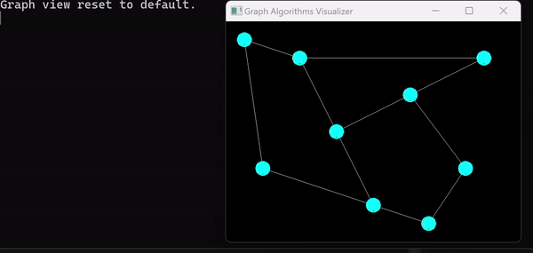
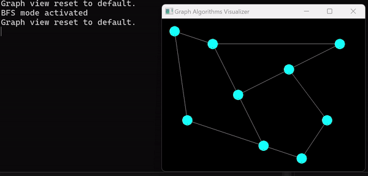

# Graph Visualization and Pathfinding

This project is a **Graph Visualization Tool** that allows users to create, explore, and solve pathfinding problems on a graph. The tool includes an interactive interface to visualize **Dijkstra's Algorithm**, **Breadth-First Search (BFS)**, and **Depth-First Search (DFS)**.

---

## Features

### **1. Interactive Graph Creation**
- Add nodes and edges interactively using the mouse.
- Nodes and edges are displayed in a clear, visually appealing manner.
- Supports dynamic graph updates during runtime.

### **2. Dijkstra's Algorithm Visualization**
- Step-by-step demonstration of the shortest path algorithm.
- Allows users to:
  - Select a **Source Node** and **Target Node**.
  - Visualize the shortest path between them.
- Highlights:
  - Yellow: Shortest path.
  - Red: Source and Target nodes.
- Ideal for understanding weighted graph traversal.

### **3. Breadth-First Search (BFS) Visualization**
- Explores the graph layer by layer starting from the source node.
- Highlights:
  - Nodes visited during traversal.
  - The order in which nodes are processed.
- Provides real-time visualization for BFS traversal.

### **4. Depth-First Search (DFS) Visualization**
- Explores as far as possible along a branch before backtracking.
- Highlights:
  - Nodes visited during traversal.
  - The recursive exploration process.
- Helps users understand backtracking and recursive graph exploration.

### **5. Reset Graph**
- Press `R` to reset the graph view.
- Clears all current visualizations and restores the default graph layout.

### **6. Dynamic Feedback**
- Displays messages in the console for user actions:
  - Node and edge selection.
  - Algorithm progress.
  - Graph reset confirmation.

### **7. Error Handling**
- Prevents invalid operations such as selecting non-existing nodes or attempting to run algorithms without a proper graph setup.

---

## How to Use

### **1. Start the Application**
- Run the application to display the graph canvas.

### **2. Add Nodes and Edges**
- Use the mouse to add nodes.
- Connect nodes by selecting edges.

### **3. Choose an Algorithm**
- **Dijkstra's Algorithm**:
  - Press `S` to activate Dijkstra Mode.
  - Click on a **Source Node** and then a **Target Node**.
- **BFS**:
  - Press `B` to activate BFS Mode.
  - Click on a **Source Node**.
- **DFS**:
  - Press `D` to activate DFS Mode.
  - Click on a **Source Node**.

### **4. Reset Graph**
- Press `R` to reset the graph view.

---

## Algorithms Demonstration

Below are videos demonstrating each algorithm:

### **1. Dijkstra's Algorithm Overview**


### **2. Breadth-First Search (BFS)**


### **3. Depth-First Search (DFS)**



---

## Technologies Used

- **Programming Language**: C++
- **Graphics Library**: SFML (Simple and Fast Multimedia Library)
- **Algorithms**:
  - Dijkstra's Shortest Path Algorithm
  - Breadth-First Search (BFS)
  - Depth-First Search (DFS)

---

## Setup and Installation

### **Requirements**
- A C++ compiler (e.g., GCC, Clang, or MSVC).
- SFML library installed on your system.

### **Steps**
1. Clone the repository:
   ``` bash
   git clone https://github.com/your-username/graph-visualization.git
   cd graph-visualization
   ```
2. Compile the project:
   ```
    g++ -std=c++17 -o graph main.cpp graph.cpp algorithms.cpp -lsfml-graphics -lsfml-window -lsfml-system

    ```
3. Run the executable
   ```
   ./graph
   ```

 --- 
  ## Future Enhancements
   -Add support for weighted edges with user-defined weights.
   -Provide save and load functionality for graph structures.
   -Implement additional algorithms such as A Algorithm* or Minimum Spanning Tree.
   -Add an intuitive UI for easier graph management.

---
## Author
  ### Vikrant Chauhan
  -For any queries or feedback, please contact: vikrantchauhan9794@gmail.com

  
